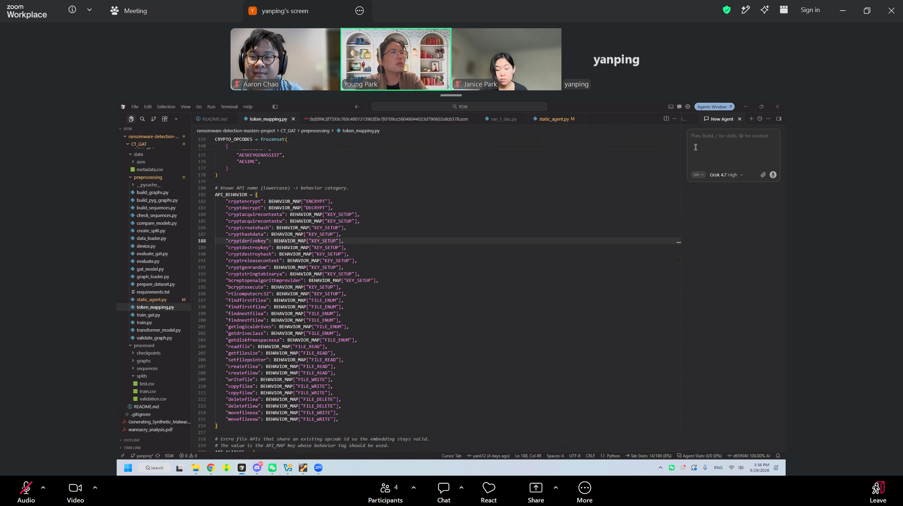

# Meeting #8 — Advisor Meeting

- **Date:** 2026-09-29
- **Start–End Time:** 3:00 PM–4:00 PM
- **Location/Mode:** Zoom Meeting

## Attendees

1. Aaron Chao
2. Yanping Li
3. Janice Park
4. Dr. Park

## 1. Accomplished Since Last Meeting

- Worked on individual model approaches.

## 2. Accomplished During This Meeting

- Focused on Yanping’s work and control flow graphs (CFGs) / IDA Pro extraction.
- Discussed investigating graph-based methods and transformers.

## 3. Issues/Blockers

- N/A.

## 4. Action Items

| Action | Owner | Due |
| --- | --- | --- |
| Investigate a CFG approach using open-source tools or IDA Pro | All | 2026-10-07 |
| Research graph-based methods | All | 2026-10-07 |
| Prepare the research paper table of contents | All | 2026-10-07 |

## 5. Plans/Goals for Next Meeting

- Finalize the CFG dataset approach and work toward completing the CFG dataset.
- Prepare the research paper table of contents.
- Present the code implementation, dataset, and intended models.

## Meeting Screenshot

