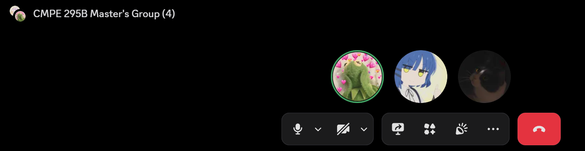

# Meeting #9 — Team Meeting

- **Date:** 2026-09-29
- **Start–End Time:** 4:00 PM–4:10 PM
- **Location/Mode:** Discord Call

## Attendees

1. Aaron Chao — Sprint Leader
2. Yanping Li
3. Janice Park

## 1. Accomplished Since Last Meeting

- Completed open-source model runs using our dataset.

## 2. Accomplished During This Meeting

- Reviewed the models worked on during the past week.
- Planned tasks for the coming weeks.

## 3. Issues/Blockers

- Coordinating concurrent work, including model development before the dataset is ready.

## 4. Action Items

| Action | Owner | Due |
| --- | --- | --- |
| Upload the dataset | Yanping and Aaron | 2026-10-07 |
| Work on the report | All | 2026-10-07 |

## 5. Plans/Goals for Next Meeting

- Draft everything together.

## Meeting Screenshot

