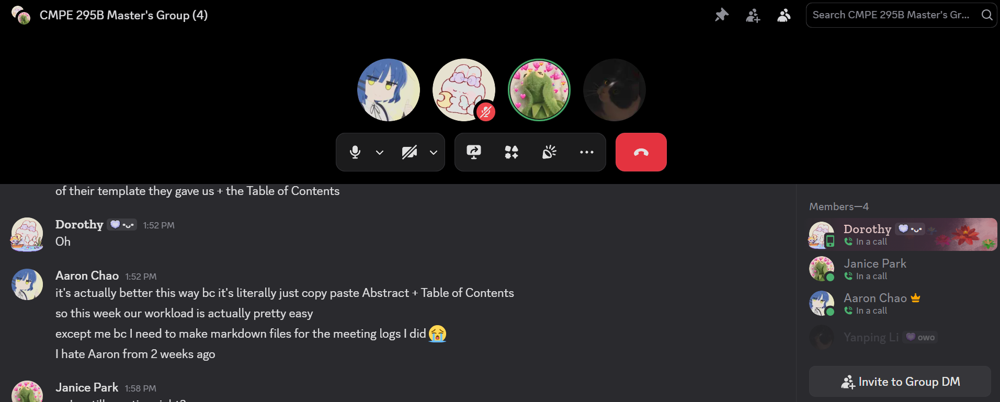

# Meeting #10 — Team Meeting

- **Date:** 2026-10-07
- **Start–End Time:** 2:00 PM–2:30 AM
- **Location/Mode:** Discord Call

## Attendees

1. Aaron Chao — Sprint Leader
2. Yanping Li
3. Dorothy Luo
4. Janice Park

## 1. Accomplished Since Last Meeting

- Set up IDA Pro.
- Created a control flow graph (CFG) block extraction script using IDAPython.
- Created opcode obfuscation and tokenization scripts.

## 2. Accomplished During This Meeting

- Focused on the upcoming table of contents assignment.
- Planned the overall project, including the research paper, poster board, and technical requirements.
- Discussed creating mappings and tokenization using CFG blocks and edges.

## 3. Issues/Blockers

- IDAPython extraction is taking longer than expected.
- Need to settle on a graph representation for CFGs.
- Need to determine comparisons with other models.

## 4. Action Items

| Action | Owner | Due |
| --- | --- | --- |
| Work on the table of contents | All | 2026-10-09 |
| Finish and submit the meeting log | Aaron | 2026-10-09 |
| Upload the dataset | Yanping and Aaron | 2026-10-14 |

## 5. Plans/Goals for Next Meeting

- Draft everything together.

## Meeting Screenshot

